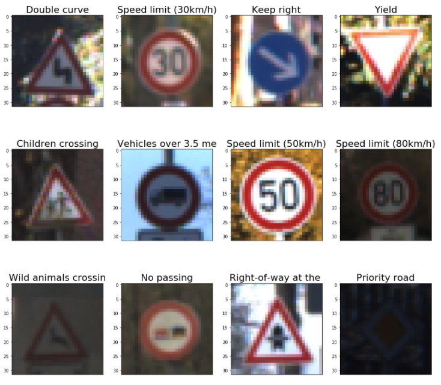
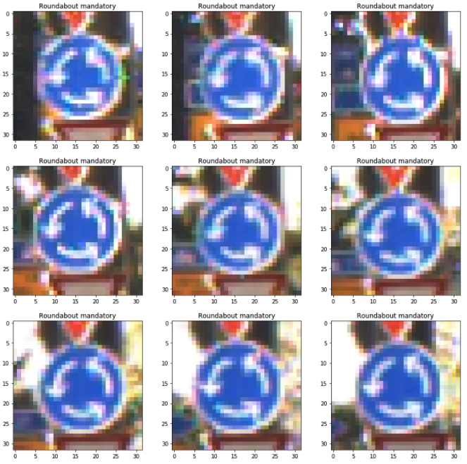
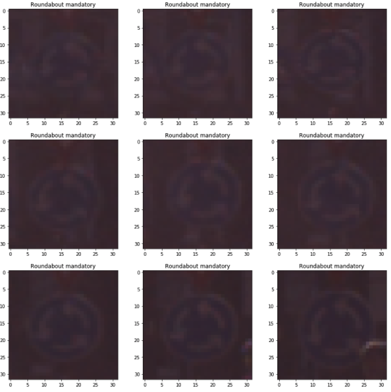
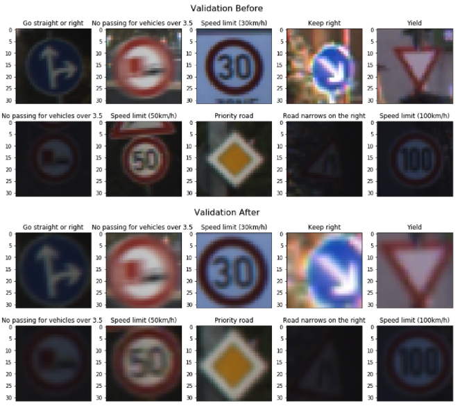
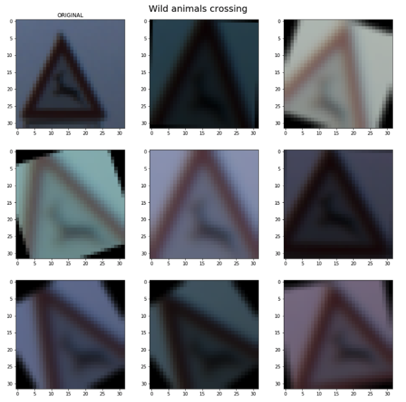
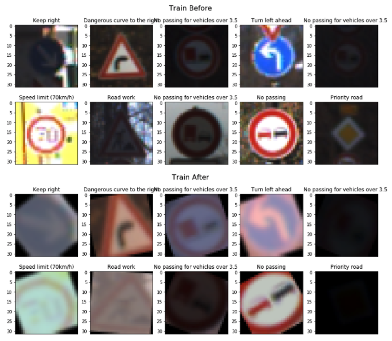
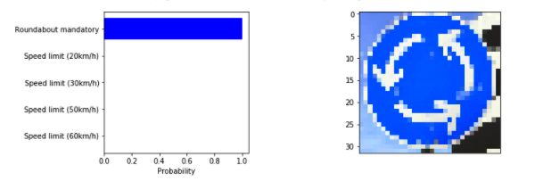
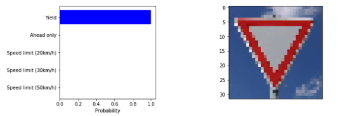
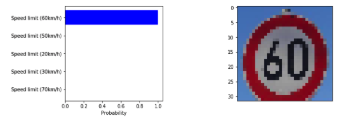
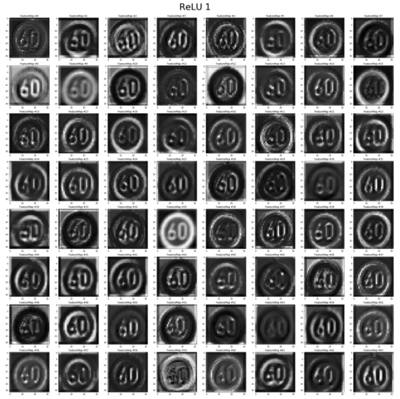

# How to Build a Convolutional Neural Net from Scratch to Get 97% Accuracy on the German Traffic Signs Dataset
The German Traffic Signs dataset was originally used for a competition at the [2011 International Joint Conference on Neural Networks](http://benchmark.ini.rub.de/). Now it serves as a benchmark dataset to test out new neural networks and approaches. Also, classifying street signs is definitely a necessary hurdle to climb if we're going to have cars that drive themselves, so it's good practice. 

The notebook in this repo will walk you through the following steps:

**1)** Load the training, validation, and test sets. These include 32x32 color images with their labels and bounding boxes for all sets.
<figure>
 
</figure>
 

 

**2)** Perform basic exploratory data analysis to ensure that every class or type of street sign is adequately represented. Also see if there are any glaring issues, like repeated images within a set or massive differences between sets.

Lots of images seem to repeat in the training set, such as this Roundabout Mandatory sign:
<figure>
 
</figure>
 

 
 
 There are also lots of repeats in the validation set:
 <figure>
 
</figure>
 

 
Furthermore, a lot of images in all sets, but especially the validation set, seem to have been artificially darkened or captured in less than desirable light conditions.

**3)** Preprocess training, validation, and test sets, including normalization and adding bounding boxes to keep only the relevant information in each image.

10 before and after bounding box preprocessing on images from the validation set:
 <figure>
 
</figure>
 

 
 
**4)** Randomly augment the training data with various techniques described in the notebook so that the network never sees the same image twice during training.

One image randomly augmented 8 times:
<figure>
 
</figure>
 

10 before and after random augmentations on images from the train set:
<figure>
 
</figure>
 

 
**5)** Design, build, train, and test a deep convolutional neural network using tensorflow and the following architecture: 

| Layer     | Description | 
|:--------------:|:-------------:| 
| Input      | images in the shape [batch size, 32, 32, 3] | 
| Conv1    | filter=5x5, stride=1, num_layers=128| 
| ReLU1 | leaky ReLU, alpha=0.2 |  
| Conv2      | filter=5x5, stride=2, num_layers=128| 
| ReLU2    | leaky ReLU, alpha=0.2  | 
| Conv3      | filter=5x5, stride=1, num_layers=256| 
| BatchNorm3  | batch normalization | 
| ReLU3    | leaky ReLU, alpha=0.2  | 
| Drop3 | dropout |  
| Conv4     | filter=5x5, stride=2, num_layers=256| 
| ReLU4    | Leaky ReLU, alpha=0.2  | 
| Conv5     | filter=3x3, stride=1, num_layers=512| 
| ReLU5    | leaky ReLU, alpha=0.2  | 
| Drop5 | dropout |
| Conv6     | filter=3x3, stride=2, num_layers=512| 
| ReLU6    | leaky ReLU, alpha=0.2  | 
| Conv7     | filter=3x3, stride=1, num_layers=512| 
| BatchNorm7  | batch normalization | 
| ReLU7    | leaky ReLU, alpha=0.2  | 
| Drop7 | dropout | 
| FC8   | fully-connected, num_units=1024  |
| ReLU8    | leaky ReLU, alpha=0.2  | 
| Drop8 | dropout |
| Logits   | fully-connected, num_units=43  |
| Out | softmax |
|     |     |

I arrived at the above architecture after lots of experimentation. For example, having strided convolutional layers rather than max pooling proved more effective for me. I found that too much batch normalization caused severe overfitting. Oddly, I found the same with too much dropout. Go figure, considering dropout is supposed to help combat overfitting. 

The cost function is softmax cross entropy. I used the Adam Optimizer with a learning rate of 0.0001 and batch size of 32.

**6)** Analyze the results by caclulating the top-5 softmax probabilities for each image in the test set. Also calculate precision and recall to flag labels that the network has problems with, which helps during experimentation when trying to find the best data augmentation techniques. This is done in detail in the notebook, but the final results are:

| Dataset     | Final Accuracy | 
|:--------------:|:-------------:| 
| Train      | 98.0% | 
| Validation    | 97.1% | 
| Test | 93.8% |  

**7)** Test the network on new images found on the web.

 <figure>
 
</figure>
 

 
 
  <figure>
 
</figure>
 

 
 
 <figure>
 
</figure>
 

 

**8)** Finally, plot the outputs of the activation functions at different layers of the network to see how it's learning. For example, early layers detect basic features like edges that help the network learn the properties of different classes.

Output of first layer's activation function on the 60 km/h sign above:
 <figure>
 
</figure>
 

 
